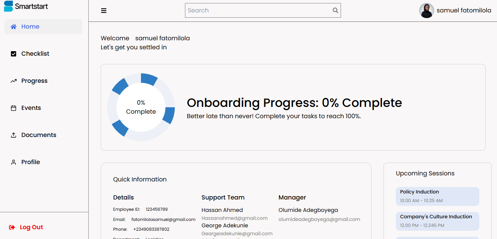

# 👷🏼‍♂️ Capstone Smart Start - Onboarding App

Smart Start is a user onboarding web application designed to guide new users through a smooth, step-by-step onboarding process.

## ✨ Features

- Multi-step onboarding flow
- Form validation
- Progress tracking
- Responsive design
- Clean and intuitive UI

## 🛠 Tech Stack

- React
- Tailwind CSS
- React hook form
- React Query
- Framer Motion
- Google Auth

## 📷 Screenshot



## ⚙ Installation

```bash
git clone https://github.com/your-username/smartstartApp.git
cd smartstartApp
npm install
npm run dev
```

## 📌 What I Learned

- Designing effective onboarding user experiences
- Effective communication with backend developers
- Buioding reusable UI components
- Managing robust SPA

## 🌎 Live Demo

[Live Site](https://capstone-smartstartapp.netlify.app)

## 📁Repository

This repository contains the full source code, configuration, and assets for the Smart Start onboarding app.
[Github Repo](https://github.com/samz845/smartstartApp)
